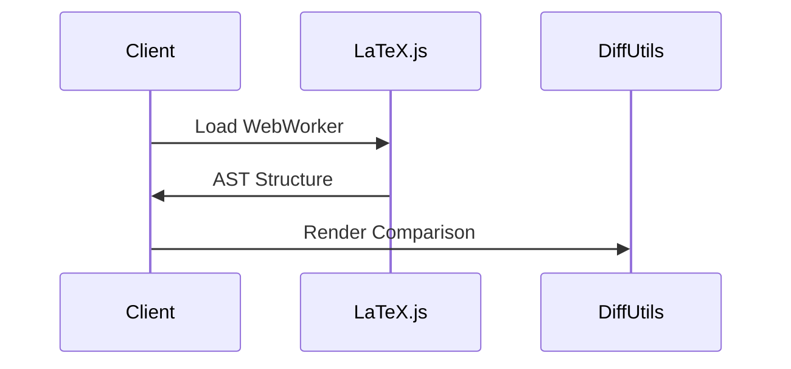
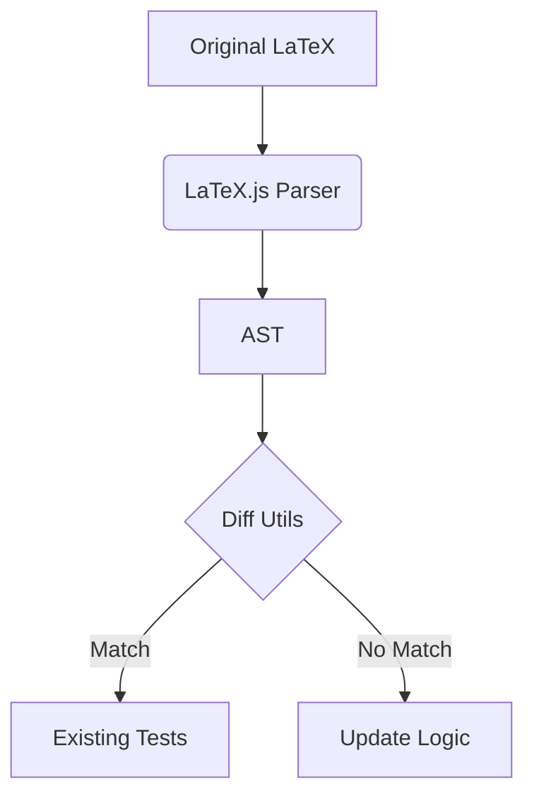

# LaTeX.js Migration Plan

## Phase 1 - Core Parser Implementation

### 1.1 Client-Side Setup


**Tasks:**
- [x] Install LaTeX.js: `npm install latex.js`
- [x] Create web worker (`public/js/latexWorker.js`)
- [x] Replace regex parsing in `extractTextFromLatex()`

**Test After:**
```bash
npm test tests/diffUtils.test.js -- -t "LaTeX parsing"
# Expected: 3 failing tests until AST implementation
```

### 1.2 Server-Side Adjustments
**Tasks:**
- [ ] Remove pdflatex dependency from `server.js`
- [ ] Add HTML endpoint (`/get-preview`)
- [ ] Update PDF generation to use browser print

**Test After:**
```bash
npm test tests/server.test.js -- -t "PDF"
# Expected: Update tests to validate HTML->PDF flow
```

## Phase 2 - Essential Features

### 2.1 Core Functionality Preservation


**Tasks:**
- [ ] Implement AST-to-legacy format adapter
- [ ] Maintain section comparison logic
- [ ] Preserve CSS class names for diffs

**Test After:**
```bash
npm run test:regression -- --updateSnapshot
```

## Phase 3 - Validation

### 3.1 Testing Strategy
1. After each task completion:
```bash
npm test -- --findRelatedTests path/to/modified/file.js
```
2. Full validation:
```bash
npm run test:full && npm run lint
```

## Maintenance Plan
```bash
# Daily check while migrating
npm run test:watch -- --changedSince main