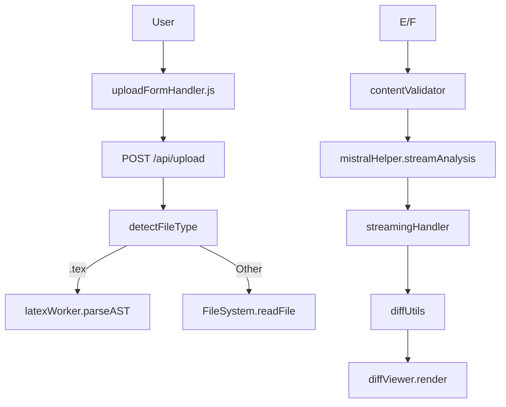
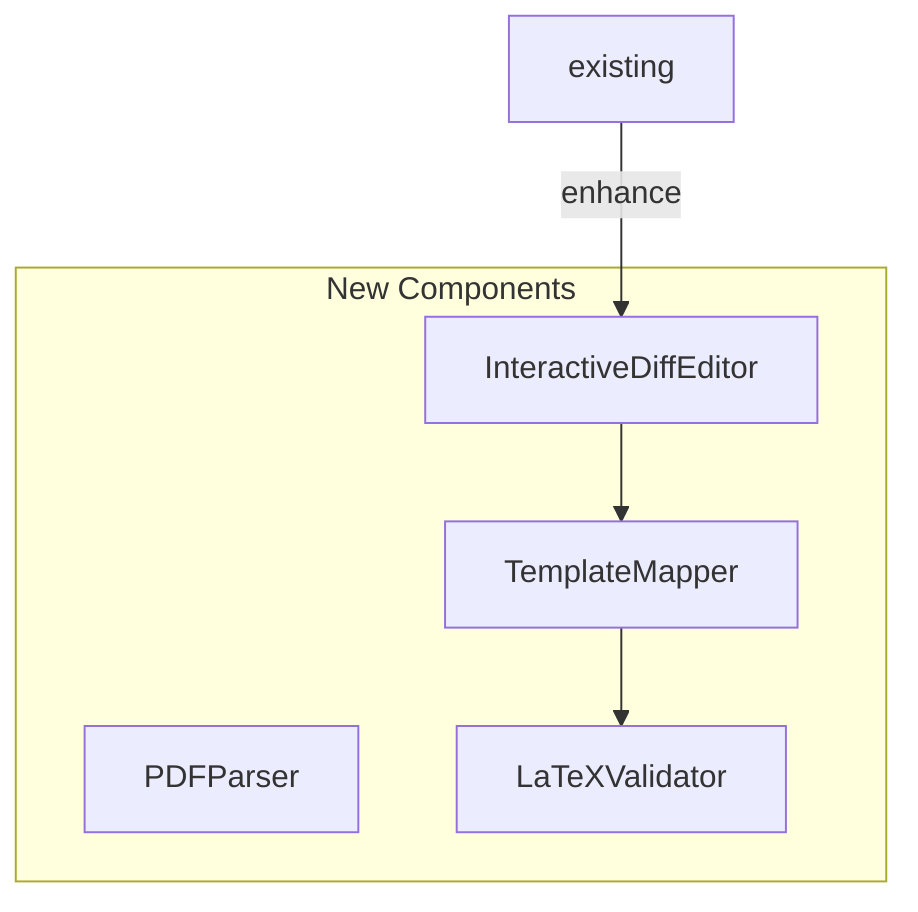

# Resume Optimization Implementation Plan

## Current Architecture Overview


## Target Architecture Additions


## Implementation Tasks

### 1. File Processing Extension
```markdown
- [ ] **PDF/DOCX Parsing**
  - Create `src/parsers/pdf.js` using PDF.js
  - Implement text extraction with position tracking
  - Add error handling for encrypted files
  - Reference: PROJECT_GUIDE lines 78-79 (PDF handling stub)

- [ ] **Enhanced Format Router**
  - Modify `utils/fileType.js` to handle magic numbers
  - Add MIME type validation
  - Connect to new parsers
```

### 2. AI Processing Phases
```javascript
// streamingHandler.js modifications
export class PhaseHandler {
  constructor() {
    this.phases = new Map([
      ['optimize', this.optimizePhase],
      ['templating', this.templatePhase]
    ]);
  }
  
  async processPhase(phaseName, content, jd) {
    const phaseFn = this.phases.get(phaseName);
    return phaseFn(content, jd);
  }
}
```

### 3. Interactive Diff Editor
```markdown
- [ ] **Editable Diff Component**
  - Modify `diffUtils.js` to return contenteditable HTML
  - Add change tracking in `stateManager.js`
  - Implement version comparison

- [ ] **UI Integration**
  - Create `public/js/views/editorView.js`
  - Add save/revert buttons with event handlers
  - Style editable diffs with CSS classes
```

### 4. Template Mapping System
```markdown
- [ ] **LaTeX Template Engine**
  - Create `src/services/templateMapper.js`
  - Implement AST pattern matching
  - Add placeholder detection from Resume-template.tex

- [ ] **Validation Service**
  - Create `src/validators/latexValidator.js`
  - Check required sections match template
  - Verify LaTeX command integrity
```

## Test Plan
```markdown
- [ ] **End-to-End Tests**
  - Add `tests/resumeWorkflow.test.js`
  - Cover PDF→Edit→LaTeX→PDF flow
  - Verify content preservation

- [ ] **Performance Tests**
  - Benchmark PDF parsing (target: <2s/page)
  - Measure memory usage during AI phases
```

## Documentation Updates
```markdown
- [ ] Update PROJECT_GUIDE.md
  - Add new architecture diagram
  - Document parser interfaces

- [ ] Add DEVELOPER.md
  - Phase handling documentation
  - Template mapping rules
```

```mermaid
gantt
    title Implementation Timeline
    section Core
    File Parsing      :active, 2025-03-17, 3d
    Phase Handling    :2025-03-19, 2d
    section UI
    Diff Editor       :2025-03-20, 4d
    section Validation
    Template Mapping  :2025-03-22, 3d